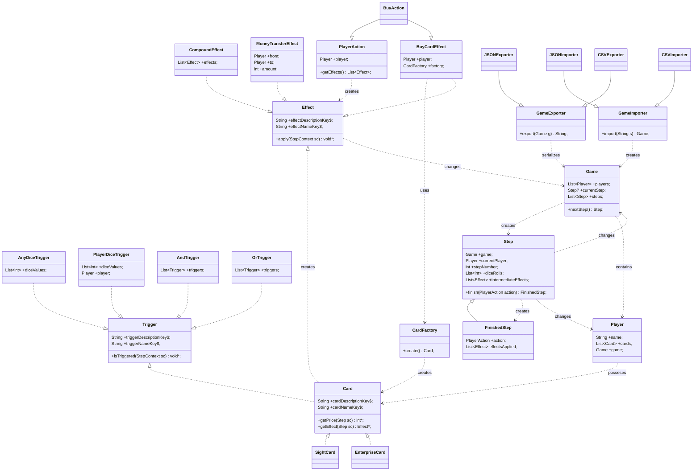

```mermaid
classDiagram
    class Trigger {
	    String +triggerDescriptionKey$;
	    String +triggerNameKey$;
	    +isTriggered(StepContext sc) void*;
    }
    
    class AnyDiceTrigger {
	    List~int~ +diceValues;
    }
    class PlayerDiceTrigger {
	    List~int~ +diceValues;
	    Player +player;
    }
	class AndTrigger {
		List~Trigger~ +triggers;
	}
	class OrTrigger {
		List~Trigger~ +triggers;
	}
    
    AnyDiceTrigger ..|> Trigger
    AndTrigger ..|> Trigger
    OrTrigger ..|> Trigger
    PlayerDiceTrigger ..|> Trigger
    
    class Effect {
	    String +effectDescriptionKey$;
	    String +effectNameKey$;
	    +apply(StepContext sc) void*;
    }
    
    class CompoundEffect {
	    List~Effect~ +effects;
    }
    
    class MoneyTransferEffect {
	    Player +from;
	    Player +to;
	    int +amount;
    }
    
    class BuyCardEffect {
	    Player +player;
	    CardFactory +factory;
    }
    
    BuyCardEffect ..> CardFactory : uses
    
    CompoundEffect ..|> Effect
    BuyCardEffect ..|> Effect
	MoneyTransferEffect ..|> Effect 
   
    class PlayerAction {
	    Player +player;
	    +getEffects() List~Effect~;
    }
    
    PlayerAction ..> Effect : creates

    class Card {
	    String +cardDescriptionKey$;
	    String +cardNameKey$;
	    +getPrice(Step sc) int*;
	    +getEffect(Step sc) Effect*;
    }
    
    class CardFactory {
	    +create() Card;
    }
    CardFactory ..> Card : creates
    
    class BuyAction {
	    
    }
    
    BuyAction --|> PlayerAction
    BuyAction --|> BuyCardEffect
    
    class Step {
	    Game +game;
	    Player +currentPlayer;
	    int +stepNumber;
	    List~int~ +diceRolls;
	    List~Effect~ +intermediateEffects;
	    +finish(PlayerAction action) FinishedStep;
    }

	class FinishedStep {
		PlayerAction +action;
		List~Effect~ effectsApplied;
	}
	
	Step <|-- FinishedStep
    
    class Game {
	    List~Player~ +players;
	    Step? +currentStep;
	    List~Step~ +steps;
	    +nextStep() Step;
    }
    
    Game ..> Step : creates
	Step ..> FinishedStep : creates
    
    class SightCard
    class EnterpriseCard
    
    class Player {
	    String +name;
	    List~Card~ +cards;
	    Game +game;
    }
    
    class GameExporter {
	    +export(Game g) String;
    }
    
    class GameImporter {
	    +import(String s) Game;
    }
    
    GameImporter ..> Game : creates
    GameExporter ..> Game : serializes
    
    JSONExporter --|> GameExporter
    JSONImporter --|> GameImporter
    CSVExporter --|> GameExporter
    CSVImporter --|> GameImporter
    
    Player ..> Card : posseses
    Game ..> Player : contains
    Effect <|.. Card : creates
    Trigger <|.. Card
    Effect ..> Game : changes
    Step ..> Game : changes
    Step ..> Player : changes
    Card <|.. SightCard
    Card <|.. EnterpriseCard
```

