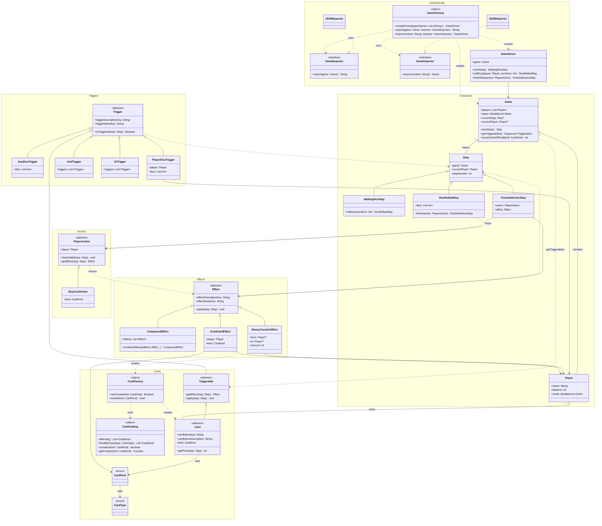

Для описания дальнейшей логики используется диаграма классов выше. Далее будут описаны отдельные моменты.

#### Роль GameDriver
Основная роль --- ведение игры. В неё входит:
1. Приём команд от разных игроков, проверка соответствует ли порядок ходов правилам
2. Обработка ошибок на каждую команду, возвращение результата для игрока
3. Правильное завершение игры

### Эффекты
Эффекты --- единственное, что может изменять игру. Действия игроков и карточки порождают эффекты,
которые в свою очередь ответственны за поддержку инвариантов.

