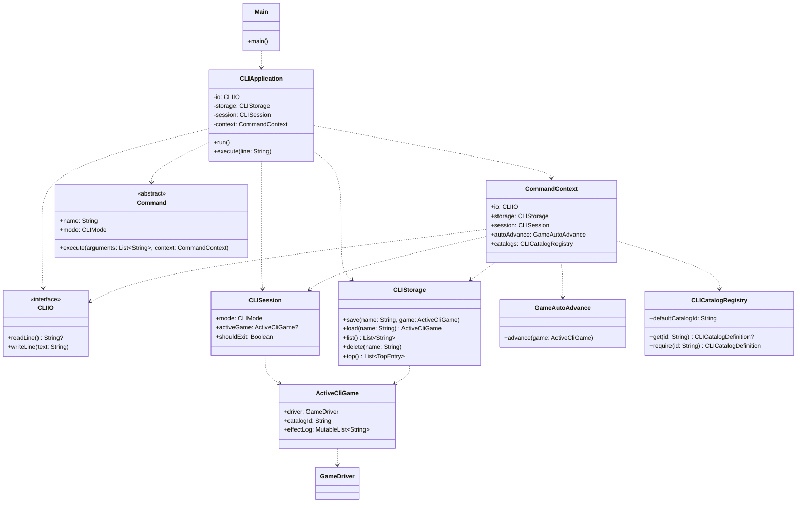

# CLI

CLI работает в двух режимах:
- `management` для создания, загрузки и удаления сохранений
- `game` для команд активной игры

## Простая диаграмма классов

## Базовая архитектура

### Точка входа
- `MainKt.main()` создаёт `CLIApplication` и запускает `run()`.
- `CLIApplication` читает команды, печатает prompt и выбирает нужную команду по текущему `CLIMode`.

### Состояние сессии
- `CLISession` хранит текущий режим и ссылку на `ActiveCliGame`.
- `ActiveCliGame` хранит `GameDriver`, `catalogId` сохранения и локальный `effectLog`, который CLI печатает после выполнения команд.

### Выполнение команд
- `CommandContext` хранит все зависимости CLI в одном месте: I/O, storage, session, auto-advance, localiser и registry каталогов.
- Команды разделены на два набора:
  - `managementCommands()` для `start`, `load`, `list`, `delete`, `top`, `exit`
- `gameCommands()` для `save`, `info`, `buyCard`, `roll`, `pickPlayer`, `swap`, `rethrow`, `keep`, `takeAdditionalStep`, `skipAdditionalStep`, `listCards`, `addTwo`
- После каждой команды `CLIApplication` вызывает `flushGameState()`: продвигает игру дальше, печатает effect log и показывает ожидаемый input effect, если он есть.

### Каталоги и сохранения
- `CLICatalogRegistry` хранит доступные каталоги и каталог по умолчанию.
- При `start` CLI создаёт игру на каталоге по умолчанию.
- При `save` в JSON пишется `catalogId`.
- При `load` storage читает `catalogId` из JSON и загружает игру с нужным `CardCatalog`.

## Режим игры
1. `save <name>` --- сохранить игру под данным названием
2. `info [playername]` --- информация об игроке, если не указан, то выводится информация о текущем игроке
3. `buyCard <cardid>` --- купить карточку, если у этого игрока есть такая возможность
4. `roll <1|2>` --- бросить 1 или 2 кубика, если игра ожидает выбор количества кубиков
5. `pickPlayer <playername>` --- выбрать игрока, с которого необходимо взять оплату
6. `swap <playername> <theirCardId> <yourCardId>` --- обменяться выбранными карточками с игроком
7. `rethrow` --- перебросить кубики, если у игрока есть такая возможность
8. `keep` --- оставить текущий бросок без переброса
9. `takeAdditionalStep` --- согласиться на дополнительный ход
10. `skipAdditionalStep` --- отказаться от дополнительного хода
11. `listCards` --- выводит список карточек
12. `addTwo` --- добавить 2 к числам на кубике

## Режим управления
1. `top` --- топ игроков по выйгрышам
2. `list` --- список игр
3. `load <name>` --- загрузить игру
4. `delete <name>` --- удалить игру
5. `exit` --- выйти из игры
6. `start` --- создание новой игры
