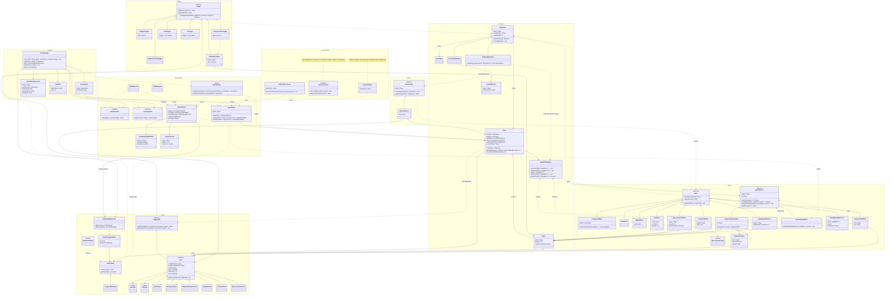

```mermaid
classDiagram
    namespace Triggers {
        class Trigger {
            <<abstract>>
            +triggerDescriptionKey: String
            +triggerNameKey: String
            +isTriggered(stepPhase: StepPhase, possessor: Player?) Boolean
        }
        class AnyDiceTrigger {
            +dice: List~Int~
        }
        class PlayerDiceTrigger {
            +player: Player
            +dice: List~Int~
        }
        class PossessorDiceTrigger {
            +dice: List~Int~
        }
        class AndTrigger {
            +triggers: List~Trigger~
        }
        class OrTrigger {
            +triggers: List~Trigger~
        }
        class SightsCollectedTrigger
    }

    namespace Effects {
        class Effect {
            <<abstract>>
            +effectDescriptionKey: String
            +effectNameKey: String
            +apply(stepPhase: StepPhase) void
        }
        class CompoundEffect {
            +effects: List~Effect~
            +combineEffects(effects: Effect...) CompoundEffect
        }
        class NoopEffect
        class MaybeEffect {
            +inner: Effect
        }
        class MoneyTransferEffect {
            +player: Player
            +amount: Int
            +type: MoneyTransferType
        }
        class MoneyTransferType {
            <<enum>>
        }
        class FineEffect {
            +from: Player
            +to: Player
            +amount: Int
        }
         class GrantCardEffect {
             +player: Player
             +card: Card
         }
         class RemoveCardEffect {
             +from: Player
             +card: Card
         }
         class InputEffect~T~ {
             <<abstract>>
             +player: Player
             +id: String
             +checkInput(input: T) Boolean
             +isValid(stepPhase: StepPhase, input: T) Boolean
             +applyWithInput(stepPhase: StepPhase, input: T) void
             +getEffect(input: T) Effect
         }
         class AwaitInputEffect~T~ {
             +player: Player
             +targetEffect: InputEffect~T~
         }
         class DiceRollInputEffect {
             +applyWithInput(stepPhase: StepPhase, input: Int) void
         }
         class ProvideInputEffect~T~ {
             +effect: InputEffect~T~
             +input: T
             +fromPlayer: Player
         }
         class SwapCardsInputEffect {
             +to: Player
             +getAwaiter(to: Player) AwaitInputEffect
         }
         class SwapCardsInput {
             +from: Player
             +fromCard: Card
             +toCard: Card
         }
    }

    namespace Actions {
        class PlayerAction {
            <<abstract>>
            +player: Player
            +checkValid(stepPhase: StepPhase) void
            +getEffect(stepPhase: StepPhase) Effect
        }
        class BuyCardAction {
            +card: Card
        }
    }

    namespace Cards {
        class Triggerable {
            <<abstract>>
            +getEffect(stepPhase: StepPhase, possessor: Player?) Effect
            +apply(stepPhase: StepPhase, possessor: Player?) void
        }
        class Card {
            <<abstract>>
            +cardNameKey: String
            +cardDescriptionKey: String
            +cardId: String
            +type: CardType
            +totalCards: Int
            +icon: CardIcon
            +getPrice(stepPhase: StepPhase) Int
        }
        class CardCatalog {
            +get(id: String) Card?
            +getCardList() List~Card~
        }
        class CardCatalogDefinition {
            +id: String
            +catalog: CardCatalog
        }
        class CardCatalogResolver {
            +get(id: String) CardCatalog?
            +getCatalogList() List~CardCatalog~
        }
        class CompoundCatalog
        class CardType {
            <<enum>>
        }
        class CardIcon {
            <<enum>>
        }
         class NatureCard
         class RestaurantCard
         class MediumEnterpriseCard
         class StadiumCard
         class TVCentreCard
         class BusinessCentreCard
         class StandardCatalog {
             <<object>>
         }
    }

    namespace CoreGame {
         class StepPhase {
             +game: Game
             +currentPlayer: Player
             +stepNumber: Int
             +canBeFinished() Boolean
             +runTriggerables() void
         }
         class PendingStepPhase {
             +submitPlayerAction(action: PlayerAction) FinishedStepPhase?
         }
         class FinishedStepPhase
        class DiceRollResult {
            +player: Player
            +diceThrown: List~Int~
        }
        class ClassMap
         class InputEffectsQueue {
             +enqueue(effect: InputEffect~*~) void
             +addToEnd(effect: InputEffect~*~) void
             +peek() InputEffect~*~?
             +dequeue(effect: InputEffect~*~) void
             +hasEffect(effect: InputEffect~*~) Boolean
         }
        class Game {
            +catalog: CardCatalog
            +players: List~Player~
            +inputEffects: InputEffectsQueue
            +steps: MutableList~StepPhase~
            +currentStepPhase: StepPhase?
            +currentPlayer: Player?
            +nextStep() StepPhase
            +getTriggerables() Sequence~Pair~Triggerable, Player?~~
            +countCardsOfKind(id: String) Int
        }
        class Player {
            +name: String
            +balance: Int
            +cards: MutableList~Card~
        }
    }

    namespace GameFacility {
        class GameExporter {
            <<interface>>
            +export(game: GamePayload) String
        }
        class GameImporter {
            <<interface>>
            +import(content: String) GamePayload
        }
        class JSONExporter
        class JSONImporter
        class GamePayload {
            +players: List~PlayerPayload~
            +metadata: GamePayloadMetadata?
            +catalogResolver: CardCatalogResolver
            +catalog: CardCatalog
            +catalogId: String?
        }
        class GamePayloadMetadata {
            +winner: String?
            +catalogId: String?
            +finished: Boolean?
        }
        class PlayerPayload {
            +name: String
            +balance: Int
            +cards: List~String~
        }
          class GameDriver {
             +game: Game
             +nextStep() PendingStepPhase
             +rollDice(player: Player, numDice: Int) PendingStepPhase
             +finishStep(action: PlayerAction) FinishedStepPhase?
         }
        class GameFactory {
            <<object>>
            +createDriver(catalog: CardCatalog, playerNames: List~String~) GameDriver
            +createDriver(payload: GamePayload) GameDriver
        }
    }

    namespace Storage {
        class GameStorage {
            +save(name: String, game: GameDriver, catalogId: String) void
            +load(name: String) StoredGame
            +list() List~SavedGameSummary~
            +delete(name: String) void
            +top() List~TopEntry~
        }
        class StoredGame {
            +driver: GameDriver
            +catalogId: String
        }
        class SavedGameSummary {
            +name: String
            +playerNames: List~String~
            +finished: Boolean
            +winnerName: String?
            +catalogId: String
        }
        class TopEntry {
            +playerName: String
            +wins: Int
        }
    }

    namespace UserInterface {
        class CommandProcessor {
            GameDriver +driver
            +processCommand(command: GameCommand) void
        }

        class GameCommand {
            <<interface>>
            +checkValid(GameDriver driver) bool
            +execute(GameDriver driver) void
        }
      note for GameCommand "checkValid throws exception if command is invalid, returns true otherwise"

        class ReactiveGame {
            GameDriver +driver
        }
        note for ReactiveGame "Makes the game state observable, implementation dependent"
    }

    CommandProcessor ..> GameDriver : uses
    ReactiveGame ..> GameDriver : uses

    Trigger <|-- AnyDiceTrigger
    Trigger <|-- PlayerDiceTrigger
    Trigger <|-- PossessorDiceTrigger
    Trigger <|-- AndTrigger
    Trigger <|-- OrTrigger
     Trigger <|-- SightsCollectedTrigger
     Trigger <|-- Triggerable

     Triggerable <|-- Card
     Card <|-- NatureCard
     Card <|-- RestaurantCard
     Card <|-- MediumEnterpriseCard
     Card <|-- StadiumCard
     Card <|-- TVCentreCard
     Card <|-- BusinessCentreCard

     Effect <|-- CompoundEffect
     Effect <|-- NoopEffect
     Effect <|-- MaybeEffect
     Effect <|-- MoneyTransferEffect
     Effect <|-- FineEffect
     Effect <|-- GrantCardEffect
     Effect <|-- RemoveCardEffect
     Effect <|-- AwaitInputEffect
     Effect <|-- ProvideInputEffect
     InputEffect <|-- DiceRollInputEffect
     InputEffect <|-- SwapCardsInputEffect

     InputEffect <.. AwaitInputEffect : targetEffect
     InputEffect <.. ProvideInputEffect : effect

     PlayerAction <|-- BuyCardAction

     StepPhase <|-- PendingStepPhase
     StepPhase <|-- FinishedStepPhase

     MoneyTransferEffect --> MoneyTransferType
     Card --> CardType
     Card --> CardIcon

     CardCatalog <|-- CompoundCatalog
     StandardCatalog ..> CardCatalog : instance
     CardCatalogResolver --> CardCatalogDefinition
     CardCatalogDefinition --> CardCatalog

     Player "1" o-- "*" Card : owns
     Game "1" o-- "*" Player : contains
     Game "1" o-- "*" StepPhase : history
     StepPhase --> ClassMap : results
     ClassMap --> DiceRollResult
     Game --> InputEffectsQueue
     Game --> CardCatalog

     PlayerDiceTrigger --> Player
     PossessorDiceTrigger ..> PlayerDiceTrigger
     SightsCollectedTrigger ..> CardCatalog

     MoneyTransferEffect --> Player
     FineEffect --> Player
     GrantCardEffect --> Player
     GrantCardEffect --> Card
     RemoveCardEffect --> Player
     RemoveCardEffect --> Card
     SwapCardsInputEffect --> Player
     SwapCardsInputEffect --> SwapCardsInput

     BuyCardAction --> Card
     BuyCardAction --> Game

     Trigger ..> StepPhase
     Effect ..> StepPhase
     InputEffect ..> StepPhase
     PlayerAction ..> Effect : returns
     Game ..> Triggerable : getTriggerables

     PendingStepPhase ..> PlayerAction : submitPlayerAction
     GameDriver ..> DiceRollInputEffect : rollDice
     PendingStepPhase ..> InputEffectsQueue : waits until queue is empty
     InputEffectsQueue ..> InputEffect : stores
     AwaitInputEffect ..> InputEffectsQueue : enqueue
     ProvideInputEffect ..> InputEffectsQueue : dequeue

     JSONExporter ..|> GameExporter
     JSONImporter ..|> GameImporter
     JSONExporter ..> GamePayload : serializes
     JSONImporter ..> GamePayload : parses
     GamePayload --> PlayerPayload
     GamePayload --> GamePayloadMetadata
     GamePayload --> CardCatalogResolver : resolves catalog
     GamePayload ..> CardCatalog : catalog getter
     GameDriver --> Game
     GameFactory ..> Game : creates
     GameFactory ..> GameDriver : creates
     GameFactory ..> GamePayload : imports
     GameStorage --> GameImporter
     GameStorage --> GameExporter
     GameStorage --> CardCatalogResolver
     GameStorage ..> GamePayload
     GameStorage ..> GameFactory
     GameStorage --> StoredGame
     GameStorage --> SavedGameSummary
     GameStorage --> TopEntry
     StoredGame --> GameDriver
```

Для описания дальнейшей логики используется диаграмма классов выше. Далее перечислены моменты.

